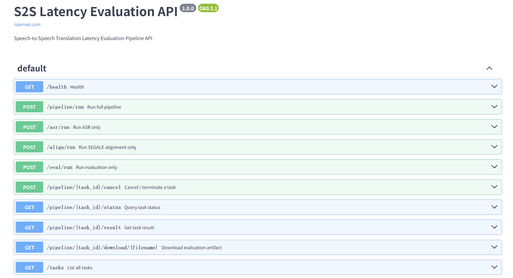
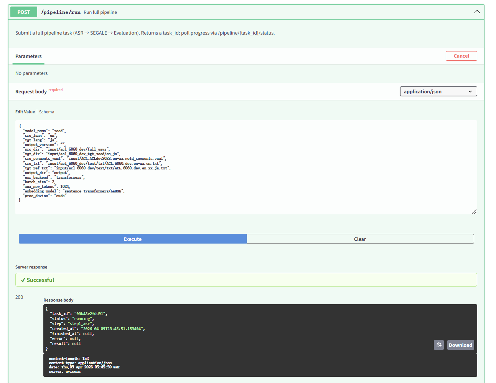

# Speech-to-Speech Latency

Evaluation pipeline for measuring latency in speech-to-speech translation systems.

## Setup (AutoDL / Linux + GPU)

```bash
# Enable network acceleration (AutoDL platform only, skip for other environments)
source /etc/network_turbo

# 1. Clone the repository
cd <base_path>
git clone https://github.com/SakaiXue6666/Speech-to-Speech-Latency.git
cd Speech-to-Speech-Latency

# 2. Create conda environment
conda create -n s2s_latency python=3.10 -y
conda activate s2s_latency

# 3. Install dependencies
pip install -r requirements.txt

# 4. Install GPU version of PyTorch
# Run nvidia-smi to check your CUDA version first:
#   CUDA 12.4 → cu124
#   CUDA 12.8 → cu128 (required for RTX 50 series / Blackwell)
pip install --force-reinstall torch --index-url https://download.pytorch.org/whl/cu124

# 5. Build vecalign Cython extension
cd SEGALE/vecalign
python -c "from setuptools import setup, Extension; from Cython.Build import cythonize; import numpy; setup(ext_modules=cythonize('dp_core.pyx'), include_dirs=[numpy.get_include()], script_args=['build_ext', '--inplace'])" || true
# --inplace may report a path error; manually copy the .so from build/
cp build/lib.*/SEGALE/vecalign/dp_core.*.so .
cd ../..

# 6. Install SEGALE
pip install --no-deps -e ./SEGALE

# 7. spaCy language models (install as needed)
python -m spacy download zh_core_web_sm   # Chinese
python -m spacy download de_core_news_sm  # German
pip install "ginza==5.2.0" "ja-ginza==5.2.0" "confection==0.1.5"  # Japanese (confection 1.x has breaking changes)

# 8. Download HuggingFace model weights (required on first run, cached offline afterwards)
export HF_ENDPOINT=https://hf-mirror.com  # Mirror for faster downloads in China
huggingface-cli download Qwen/Qwen3-ASR-1.7B
huggingface-cli download Qwen/Qwen3-ForcedAligner-0.6B
huggingface-cli download sentence-transformers/LaBSE
```

## Usage

Edit `config.py` to set the language pair, model name, and other parameters, then:

```bash
# Run the full pipeline (ASR → alignment → evaluation)
python main.py

# Generate plots
python plot/ending_offset_delay.py
python plot/tgt_minus_src_length_histogram.py
```

## Input directory structure

```
input/
├── ACL.ACLdev2023.en-xx.gold_segments.yaml
├── acl_6060_dev/
│   ├── full_wavs/          # Source audio
│   └── text/txt/           # Source / target reference text
└── acl_6060_dev_tgt_{model_name}/
    └── {src_lang}_{tgt_lang}/   # Target audio (organized by system name)
```

## Output directory structure

```
output/
└── {model_name}/
    └── {src_lang}_{tgt_lang}/
        ├── output_asr/          # ASR results
        ├── output_segale/       # Alignment results
        └── output_evaluation/   # Evaluation results + plots
```

## API Usage

In addition to running `python main.py` directly, this project provides an HTTP API for remote invocation or integration with other systems.

### 1. Start the API server

```bash
# Install additional dependencies (first time only)
pip install fastapi "uvicorn[standard]" pydantic

# Start the server
uvicorn api:app --host 0.0.0.0 --port 8000 --workers 1
```

Once started, visit http://localhost:8000/docs for the interactive API documentation.

<p align="center">
  
  <br>
  
</p>

### 2. API endpoints

| Method | Path | Description |
|--------|------|-------------|
| `GET` | `/health` | Health check (includes GPU status) |
| `POST` | `/pipeline/run` | Start full pipeline (ASR → SEGALE → evaluation) |
| `POST` | `/asr/run` | Run ASR only |
| `POST` | `/align/run` | Run SEGALE alignment only (requires ASR output) |
| `POST` | `/eval/run` | Run evaluation only (requires alignment output) |
| `GET` | `/pipeline/{task_id}/status` | Query task status |
| `GET` | `/pipeline/{task_id}/result` | Get evaluation results |
| `POST` | `/pipeline/{task_id}/cancel` | Cancel or terminate a task |
| `GET` | `/pipeline/{task_id}/download/{filename}` | Download output files |
| `GET` | `/tasks` | List all tasks |

### 3. Request parameters

All `POST` endpoints accept parameters via JSON body. Fields correspond to `PipelineConfig` in `config.py`.  
Omitted fields use default values.

| Parameter | Type | Default | Description |
|-----------|------|---------|-------------|
| `model_name` | string | `"seed"` | Name of the system to evaluate |
| `src_lang` | string | `"en"` | Source language |
| `tgt_lang` | string | `"ja"` | Target language (`zh` / `de` / `ja`) |
| `src_dir` | string | `"input/acl_6060_dev/full_wavs"` | Source audio directory |
| `tgt_dir` | string | `"input/acl_6060_dev_tgt_seed/en_ja"` | Target (translated) audio directory |
| `src_segments_yaml` | string | `"input/ACL.ACLdev2023.en-xx.gold_segments.yaml"` | Source audio segmentation file |
| `src_txt` | string | `"input/acl_6060_dev/text/txt/ACL.6060.dev.en-xx.en.txt"` | Source language text |
| `tgt_ref_txt` | string | `"input/acl_6060_dev/text/txt/ACL.6060.dev.en-xx.ja.txt"` | Target language reference translation |
| `output_dir` | string | `"output"` | Output directory |
| `asr_backend` | string | `"transformers"` | ASR backend (`transformers` / `vllm`) |
| `batch_size` | int | `2` | ASR batch size |
| `max_new_tokens` | int | `1024` | ASR max generation tokens |
| `embedding_model` | string | `"sentence-transformers/LaBSE"` | SEGALE embedding model |
| `proc_device` | string | `"cuda"` | Compute device |

> **Note**: All path parameters refer to paths **on the server**. Upload your audio files to the server before calling the API.

### 4. Python example

```python
import requests
import time

SERVER = "http://localhost:8000"

# Step 1: Submit a full pipeline task
resp = requests.post(f"{SERVER}/pipeline/run", json={
    "model_name": "seed",
    "tgt_lang": "ja",
    "tgt_dir": "input/acl_6060_dev_tgt_seed/en_ja",
})
task_id = resp.json()["task_id"]
print(f"Task submitted: {task_id}")

# Step 2: Poll until completion
while True:
    status = requests.get(f"{SERVER}/pipeline/{task_id}/status").json()
    print(f"  Status: {status['status']}  Step: {status['step']}")
    if status["status"] in ("completed", "failed", "cancelled"):
        break
    time.sleep(10)

# Step 3: Retrieve evaluation results
if status["status"] == "completed":
    result = requests.get(f"{SERVER}/pipeline/{task_id}/result").json()
    print("Results:", result)
    # result["scores"] contains BLEU, YAAL, CA-YAAL, ending offset, etc.
```

### 5. Task management

- **Only 1 task runs at a time** (GPU memory constraint). Additional tasks are queued.
- **Cancel a task**: `POST /pipeline/{task_id}/cancel` — cancels queued tasks immediately; force-terminates running tasks.
- **List all tasks**: `GET /tasks` — returns all tasks and their statuses.
- Restarting the server clears in-memory task records, but output files already written to `output/` are preserved.
